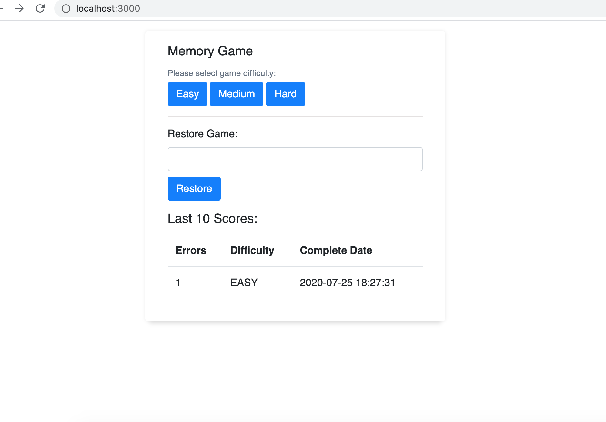
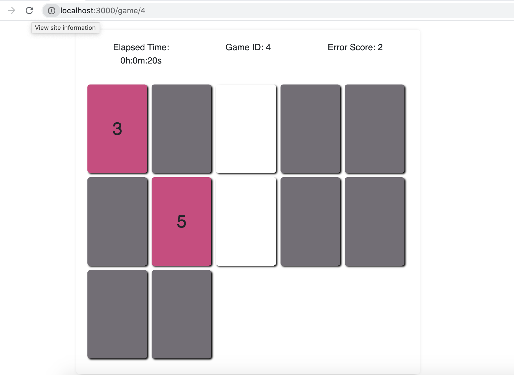

# Run instruction

```
npm install
npm start
// this starts the server at localhost:5000

open new terminal
cd client
npm install
npm start
// this starts the client at localhost:3000
```

# Application is fully responsive

There are few minor modifications to the requirements,

1. EASY will launch a game with **6 cards instead of 5**, HARD will launch a game with **26 cards instead of 25**

   Because if there are odd numbers of card, the game can never be finished

2. If the 2 cards picked were incorrect, user **WILL NOT be able to select** another card until **AFTER the cards fade in 5 seconds**

   Letting users pick cards before previous selections dissappear will make the game too easy

   However, this **behaviour can be removed** by removing  || this.state.isDisableInput at /client/src/component/game/game.js line 95 with **no problems**

# Screeshots




# Routes

There are 4 routes from the server

```
POST localhost:5000/api/create-game
body: { "difficulty": "EASY" } // or "MEDIUM" or "HARD"
Create a game with cards

GET localhost:5000/api/game/:id
Get info about a game with id

GET localhost:5000/api/game-scores
Get scores of last 10 completed games

GET localhost:5000/api/flip/card/:position/game/:id
Flip card of game
```

# Sample Database

```
CREATE TABLE game (
    id INTEGER PRIMARY KEY AUTOINCREMENT,
    difficulty_setting TEXT NOT NULL, -- 'EASY', 'MEDIUM', 'HARD'
    error_score BIGINT NOT NULL DEFAULT 0,
    create_date TIMESTAMP NOT NULL DEFAULT CURRENT_TIMESTAMP,
    state TEXT NOT NULL DEFAULT 'IN_PROGRESS', -- 'IN_PROGRESS', 'COMPLETED'
    complete_date TIMESTAMP NULL
);

CREATE TABLE game_card (
    id INTEGER PRIMARY KEY AUTOINCREMENT,
    game_id BIGINT NOT NULL references game(id),
    content_value BIGINT NOT NULL, -- NUMBER 1-13
    position BIGINT NOT NULL,
    state TEXT NOT NULL DEFAULT 'HIDDEN' -- 'HIDDEN', 'REVEALED', 'MATCHED'
);

game
id  difficulty_setting  error_score  create_date            state           complete_date
"1"	"EASY"	            "1"	    "2020-07-25 22:27:19"   "COMPLETED"	    "2020-07-25 22:27:31"
"2"	"EASY"	            "6"	    "2020-07-25 22:34:49"	"IN_PROGRESS"	

game_card
id  game_id content_value   position    state
"1"	"1"	    "2"	    "0"	    "MATCHED"
"2"	"1"	    "3"	    "1"	    "MATCHED"
"3"	"1"	    "1"	    "2"	    "MATCHED"
"4"	"1"	    "3"	    "3"	    "MATCHED"
"5"	"1"	    "1"	    "4"	    "MATCHED"
"6"	"1"	    "2"	    "5"	    "MATCHED"
"7"	"2"	    "1"	    "0"	    "HIDDEN"
"8"	"2"	    "1"	    "1"	    "HIDDEN"
"9"	"2"	    "3"	    "2"	    "MATCHED"
"10"	"2"	    "2"	    "3"	    "MATCHED"
"11"	"2"	    "3"	    "4"	    "HIDDEN"
"12"	"2"	    "2"	    "5"	    "HIDDEN"
```

# Project Structure

```
---------
Server code is in /server/

/index.js (outside) is the index.js for server

/server/utility - constants value and response formatting

/server/routes - there is only one route file, localhost:5000/api/ at 
/server/routes/game.js

/server/database - 
database.db is our database
db.js establishes connection to database.db
gameService has all the queries
schema sql is the table definition

by default database.db already has all the tables with no data
---------

---------
Client code is in /client/

/client/public/ - index.html

/client/src - react app

There are only two pages: landing and game
located inside /client/src/component/landing and /client/src/component/game
---------
```
